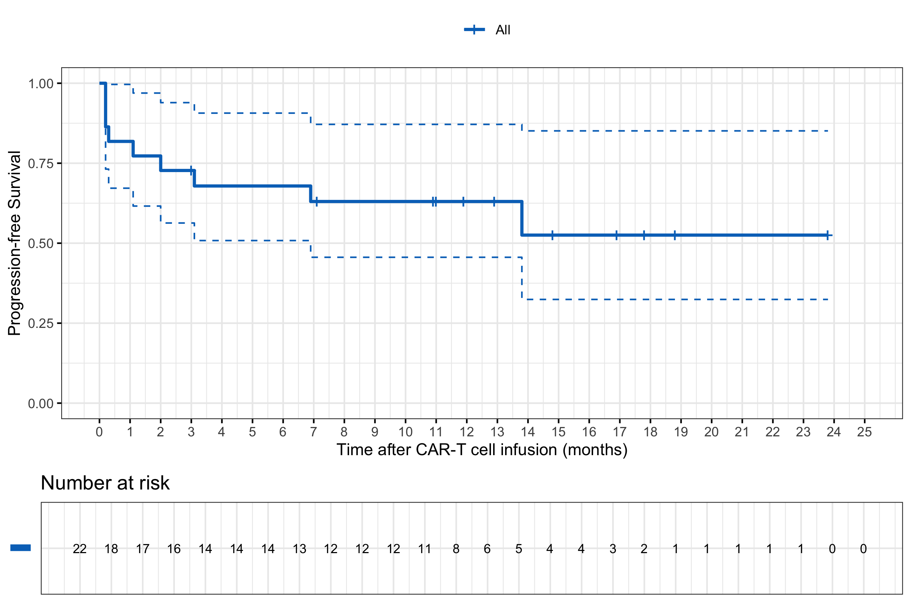

# Kochenderfer_JCO2017

Plotted are the progression-free survival probabilities using the Kaplan-Meier method. The data was extracted from the Kochenderfer et al publication "*Lymphoma Remissions Caused by Anti-CD19 Chimeric Antigen Receptor T Cells Are Associated With High Serum Interleukin-15 Levels*" in the Journal of Clinical Oncology, 2017.Full text available.

[here](https://ascopubs.org/doi/full/10.1200/JCO.2016.71.3024).



R code used to produce the curve:
```r
library(readr)
library(survival)
library(survminer)
library(prodlim)
library(htmlTable)
Kochenderfer_JCO2017_DOR <- read_csv("Kochenderfer_JCO2017_DOR.csv")
PFS=survfit(Surv(fu,event)~1,data=Kochenderfer_JCO2017_DOR)
PFS_p <- ggsurvplot(PFS,data = Kochenderfer_JCO2017_DOR,palette = "jco",legend.title="",
                    fontsize=3,risk.table.y.text = FALSE,risk.table = TRUE,conf.int = TRUE,
                    tables.theme = theme_cleantable(),ggtheme = theme_bw(),conf.int.style = "step",
                    xlab = "Time after CAR-T cell infusion (months)",ylab="Progression-free Survival",
                    xscale=1,break.time.by = 1)
PFS_p
```
# Complete table

| Time| Number at risk| Number of event| PFS probability| 95%CI - Lower limit| 95% CI - Upper limit|
|----:|--------------:|---------------:|---------------:|-------------------:|--------------------:|
|  0.2|             22|               3|            0.86|                0.73|                 1.00|
|  0.3|             19|               1|            0.82|                0.67|                 1.00|
|  1.1|             18|               1|            0.77|                0.62|                 0.97|
|  2.0|             17|               1|            0.73|                0.56|                 0.94|
|  3.1|             15|               1|            0.68|                0.51|                 0.91|
|  6.9|             14|               1|            0.63|                0.46|                 0.87|
| 13.8|              6|               1|            0.53|                0.32|                 0.85|